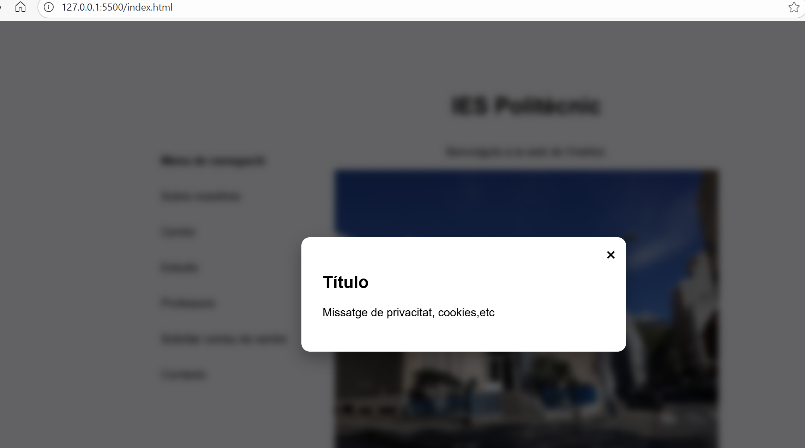
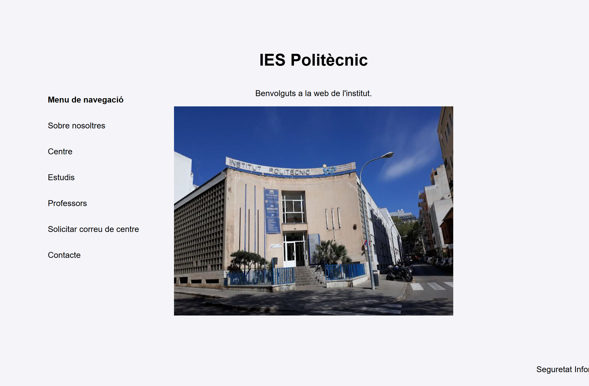

# Ventana modal — Proyecto de ejemplo

Este es un pequeño ejemplo de una página web que muestra una ventana modal (usada aquí para mensajes de privacidad/cookies) y una estructura simple de contenido.

## ¿Qué incluye la web?
- Una ventana modal implementada con HTML y CSS y activada mediante un checkbox (`#modal-toggle`) como disparador.
- Un `aside` que actúa como menú de navegación lateral.
- Un `article` con contenido principal (título, texto e imagen).
- Un `footer` con información de pie de página.

## Archivos principales
- `index.html` — estructura de la página y la ventana modal. La ventana modal está construida con:
  - Un input checkbox oculto con id `modal-toggle` que controla el estado visible/oculto de la modal.
  - Un contenedor `.modal` con `.modal-content` que incluye el botón de cierre (label asociado al checkbox) y el texto del mensaje.
- `style.css` — estilos para la modal, el layout (aside/article) y el pie de página. (Enlazado desde `index.html`.)

Fig. 1. Ventana modal

Fig. 2. Web

## Cómo funciona (resumen técnico)
- La modal se controla sin JavaScript, usando únicamente CSS y el estado del checkbox (`:checked`) para mostrar/ocultar la caja modal.
- El contenido principal está organizado en un `main` con una columna lateral (`aside`) y un `article` para el contenido principal.
- La página incluye la meta etiqueta `viewport` para que sea responsiva en móviles.

## Probar localmente
1. Abrir `index.html` en tu navegador (doble clic o mediante un servidor local).
2. La modal aparece por defecto (el checkbox está marcado). Para cerrar la modal, pulsa el botón de cierre (la `×`).

Si quieres servirlo con un servidor local rápido (Node.js instalado), en PowerShell puedes usar:

```powershell
# desde la carpeta del proyecto
python -m http.server 8000
# luego abre http://localhost:8000 en tu navegador
```

o, si prefieres, con Live Server en VS Code simplemente abre la carpeta y activa Live Server.

## Sugerencias de mejora
- Hacer que la modal se abra y cierre con JavaScript para poder controlar mejor el foco y la accesibilidad.
- Añadir atributos ARIA (`role="dialog"`, `aria-modal="true"`, `aria-labelledby`) y gestionar el foco al abrir/cerrar la modal para cumplir WCAG.
- Proporcionar alternativas para usuarios que deshabilitan CSS o tienen navegadores antiguos.
- Añadir un botón para reabrir la modal si se quiere mostrar de nuevo desde la interfaz.

## Notas
Este proyecto es una plantilla didáctica para entender cómo construir modales y layouts básicos. Puedes adaptarlo fácilmente para mensajes de privacidad, cookies, avisos o formularios.

